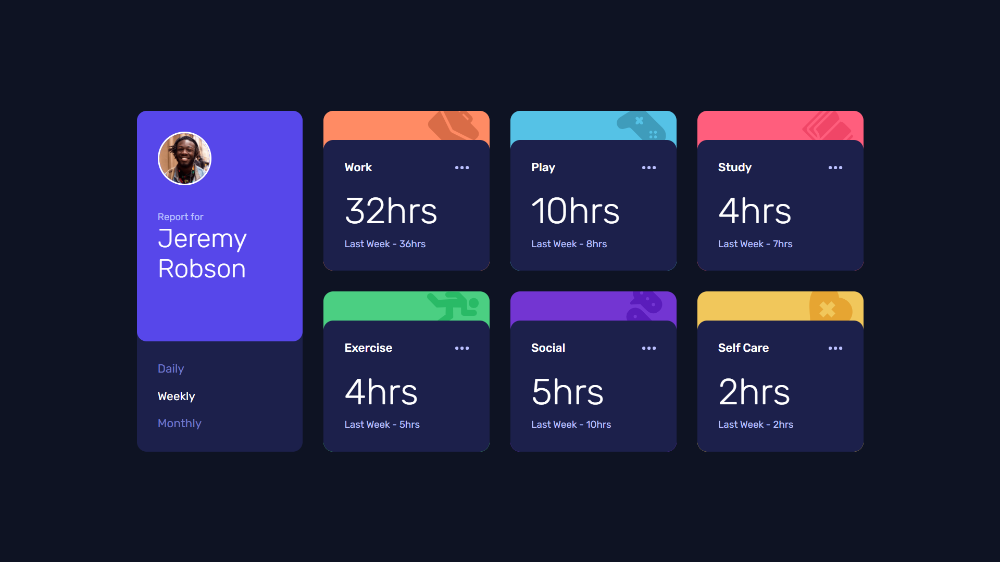

# Frontend Mentor - Time tracking dashboard solution

This is a solution to the [Time tracking dashboard challenge on Frontend Mentor](https://www.frontendmentor.io/challenges/time-tracking-dashboard-UIQ7167Jw). 

## Table of contents

- [Overview](#overview)
  - [The challenge](#the-challenge)
  - [Screenshot](#screenshot)
  - [Links](#links)
- [My process](#my-process)
  - [Built with](#built-with)
  - [What I learned](#what-i-learned)
  - [Continued development](#continued-development)
- [Author](#author)

## Overview

### The challenge

Users should be able to:

- View the optimal layout for the site depending on their device's screen size
- See hover states for all interactive elements on the page
- Switch between viewing Daily, Weekly, and Monthly stats

### Screenshot



### Links

- Solution URL: [GitHub](https://github.com/g-akca/time-tracking-dashboard)
- Live Site URL: [Time Tracking Dashboard](https://g-akca.github.io/time-tracking-dashboard/)

## My process

### Built with

- Semantic HTML5 markup
- CSS custom properties
- Flexbox
- CSS Grid
- Mobile-first workflow
- Media queries
- Dynamic JavaScript

### What I learned

I learned how to dynamically change the filling color of SVG elements:

```html
<svg width="21" height="5" xmlns="http://www.w3.org/2000/svg"><path d="M2.5 0a2.5 2.5 0 1 1 0 5 2.5 2.5 0 0 1 0-5Zm8 0a2.5 2.5 0 1 1 0 5 2.5 2.5 0 0 1 0-5Zm8 0a2.5 2.5 0 1 1 0 5 2.5 2.5 0 0 1 0-5Z" fill="currentColor" fill-rule="evenodd"/></svg>
```
```css
.card-main svg:hover {
    color: white;
}
```

It was also my first time working with JavaScript fetch on a Frontend Mentor project:

```js
async function loadData() {
    const response = await fetch("data.json");
    data = await response.json();
}
```

### Continued development

I want to keep developing more projects with fetch, await, and async functions in order to understand them fully.

## Author

- GitHub - [@g-akca](https://github.com/g-akca)
- Frontend Mentor - [@g-akca](https://www.frontendmentor.io/profile/g-akca)
